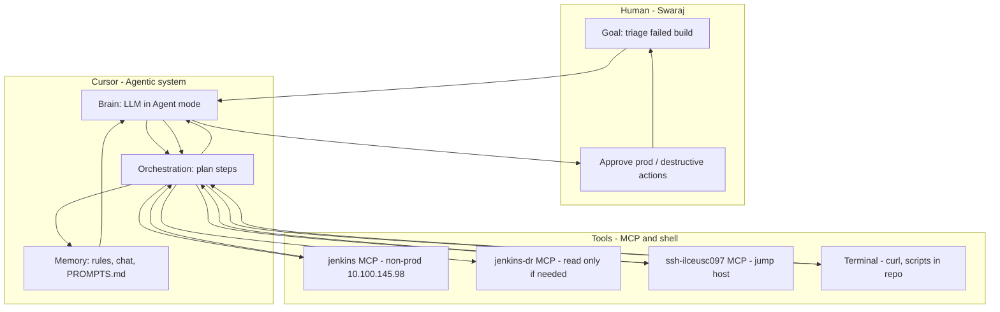

# Lab 2 — Agentic system design (Chapter 1)

**Use case:** Non-prod Jenkins failed-build triage  
**Workspace:** `MCP demo` (tools) + `AI Agentic learning` (notes & prompts)  
**Date:** 2026-05-27

---

## 1. Goal (one sentence)

When a **non-prod** Jenkins job fails, help me **understand why** (console + context), **suggest** fix steps, and **never** change prod or trigger destructive actions without my explicit approval.

**Success looks like:**

- Input: “Job X is red on non-prod” or “investigate last failed build of job Y”
- Output: 3–5 bullet summary, quoted log lines, suggested checks (SSH, config, re-run), clear “human must do” for prod

**Out of scope (for now):**

- Auto-fixing servers
- Triggering prod builds or AME bounce
- Replacing existing Unified.sh / pipeline scripts

---

## 2. Diagram



---

## 3. Core components (book → your stack)

| Component | What it is | Your implementation |
|-----------|------------|---------------------|
| **Foundation model** | Reasoning + language | Cursor Agent (Composer) |
| **Tools / skills** | Actions in the world | MCP: Jenkins API, SSH; terminal for read-only scripts |
| **Orchestration** | Order of steps | Agent loop: list/status → console → optional SSH → summarize |
| **Memory** | Context over time | `.cursor/rules/` in MCP demo; `PROMPTS.md`; `notes/`; chat history |
| **Human** | Oversight | You review output; you run prod and bounces |

---

## 4. Tool map (which MCP when)

| MCP server | Environment | Use in triage |
|------------|-------------|---------------|
| `jenkins` | Non-prod | **Default** — job list, last build, consoleText |
| `jenkins-dr` | DR | Only when you say “check DR” |
| `jenkins-prod` | Prod | **Do not use** for Lab 2 / auto-triage; often unreachable from laptop |
| `ssh-ilceusc097` | Jump `tooladm` | Follow-up: hostname, disk, process, log tail on app servers (via jump chain in rules) |

**Not agents (stay as workflows):** `ame_bounce_*.xml`, `*_Unified.sh` — fixed steps; agent **explains** failures, doesn’t replace pipelines.

---

## 5. Example orchestration flow

**Trigger:** “Last build of job `ame_ssh_test` failed on non-prod.”

| Step | Who | Action |
|------|-----|--------|
| 1 | Agent | Jenkins MCP: get job color, last build number, result |
| 2 | Agent | Jenkins MCP: fetch last 40–80 lines of `consoleText` |
| 3 | Agent | Summarize: error type, likely layer (Git, Maven, SSH, credentials) |
| 4 | Agent (optional) | If log shows host/SSH: propose SSH check via `ssh-ilceusc097` — **read-only** commands only |
| 5 | Human | Decide: re-run job, fix creds, open ticket, escalate to prod team |

**If step 1 fails (API down):** agent should say so and suggest Jenkins UI or curl from rules — not guess.

---

## 6. Guardrails (non-negotiable)

| Rule | Why |
|------|-----|
| **Non-prod first** | Default MCP = `jenkins`, not `jenkins-prod` |
| **No silent writes** | No `POST` build, no config.xml update, no bounce unless you explicitly ask |
| **Prod = propose only** | Agent may draft commands; **you** run on prod / jump host |
| **Cite sources** | Job name, build #, MCP server used, log lines quoted |
| **Secrets** | Never commit tokens; `mcp.json` stays out of `ai-agentic-learning` repo |

---

## 7. Workflow vs agent (this use case)

| Part | Type | Why |
|------|------|-----|
| Scheduled deploy / bounce | **Workflow** | Same steps every release |
| “Why did this build fail?” | **Agent** | Different logs, different root cause each time |
| “What jobs are red?” | **Agent or script** | Agent fine via Jenkins MCP |

---

## 8. Starter prompt (save to PROMPTS.md after Lab 3)

```text
Non-prod Jenkins triage only. Use jenkins MCP (not jenkins-prod).

Job: [JOB_NAME]

1. Last build status and number
2. Last 50 lines of console log
3. Summary: root cause in plain English (3 bullets)
4. Suggested next steps (read-only checks only)
5. List which MCP tools you used

Do not trigger builds or change any configuration.
```

---

## 9. Lab 2 checklist

- [x] Goal defined
- [x] Brain, tools, memory, orchestration named
- [x] Diagram drawn
- [x] Guardrails written
- [ ] Lab 3: run MCP once in `MCP demo` to validate tools
- [ ] Copy starter prompt to `PROMPTS.md`
- [ ] `git commit` this file

---

## 10. Edit me (your tweaks)

 what should the agent help with : Agent should be a able to check jenkins builds (nonprod , DR, PROD) and if it is failed , should check logs and required servers backend and only run command which are used for research and analysis, dont create or break anything in backend untill and unless explicitely required as part of resolution , that too after confirming with me
 

Brain -- claude llm used here, Anthropic
Tools -- ssh mcp, jenkins mcp, (i dont know exactly these are though)
Memory -- (we will create rules.md and prompts.md to preserve memory, so that whenever i say nonprod jenkins it should redirect to a specific URL and backend, maybe we will setup aliases in prompts.md)

You
Boss who approves
You — especially for prod


**SSH checks I usually run after a fail:**
i usually check for FS, if it is full, for connectivity involved in the job which has failed

**Anything the agent must never do:**
dont create or break anything in backend untill and unless explicitely required as part of resolution , that too after confirming with me


FLOW :

I say: “Job X failed.”
Agent checks Jenkins (status + log).
Agent explains in plain English.
Maybe suggests SSH checks (read-only).
You cannot run anything risky or on prod without confirming with me and also explain what exactly we are running and how it will impact


RULES.md :

Don’t touch prod Jenkins by default
Don’t start builds or bounces on its own, unless mentioned by me
Don’t change configs — only read and suggest